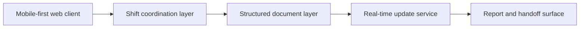

# Architecture

## High-level architecture
- Classification: CORE HEALTHCARE / CLINICAL AI
- Category: clinical-ai
- Confidence: HIGH
- Exposure risk: HIGH

## Public-safe component view
- Mobile-first web client
- Shift coordination layer
- Structured document layer
- Real-time update service
- Report and handoff surface

## Boundary notes
- This diagram is intentionally high level.
- No internal routes, private services, live storage names, or deployment details are published.
- The public-safe view is limited to product layers that can be discussed without weakening security.
