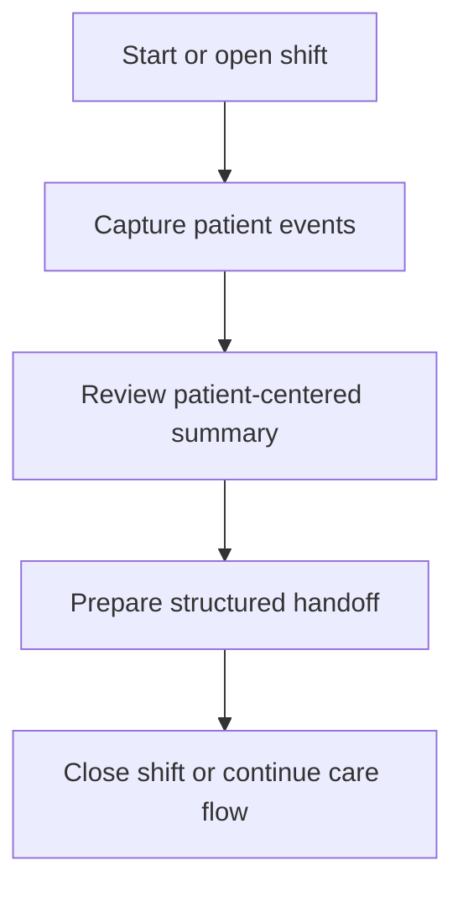

# Workflow

## High-level functional workflow
1. Start or open shift
2. Capture patient events
3. Review patient-centered summary
4. Prepare structured handoff
5. Close shift or continue care flow

## Publication boundary
- The workflow is intentionally simplified.
- No internal rules, private thresholds, or sensitive processing detail are described here.
